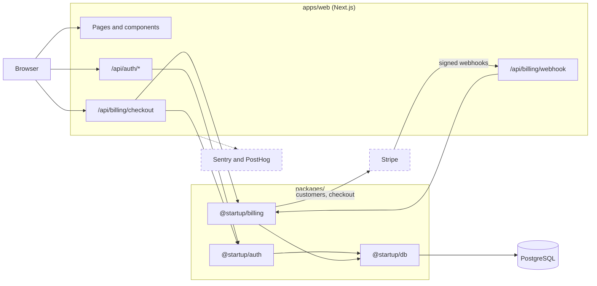
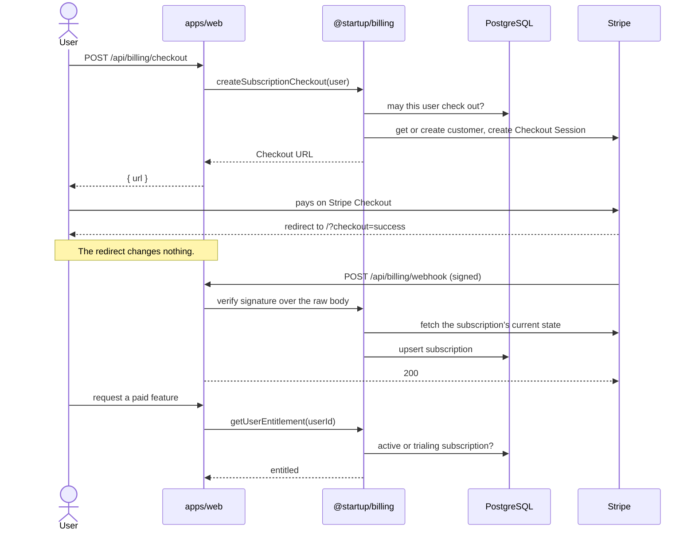
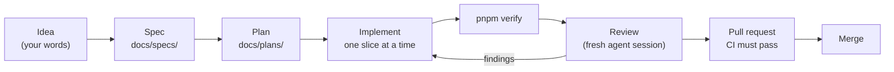
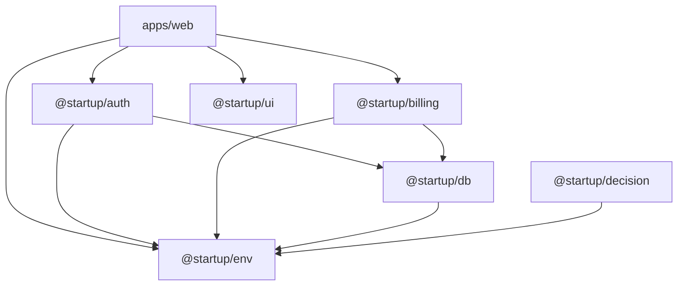

# Startup Template

## What this is

A production-oriented monorepo for starting a new web application.

It ships with the parts most products need on day one, already wired together and verified in CI:

- a Next.js application in a pnpm and Turborepo workspace
- PostgreSQL with Drizzle migrations
- authentication with Better Auth
- subscription billing with Stripe
- error monitoring with Sentry and product analytics with PostHog
- unit tests with Vitest and end-to-end tests with Playwright
- a repository harness that tells coding agents how to work here

Every integration except the database and authentication is optional locally. The application builds and runs without Stripe, Sentry, or PostHog accounts.

The template lives at [github.com/allen-padilla/startup-template](https://github.com/allen-padilla/startup-template) and is set up as a GitHub template repository.

New here? [Building a Product with an Agent](#building-a-product-with-an-agent) walks an example product from cloning the template to shipping features, with a prompt for every step.

## Stack

| Area            | Technology                                    |
| --------------- | --------------------------------------------- |
| Application     | Next.js 16 (App Router), React 19, TypeScript |
| Styling         | Tailwind CSS 4                                |
| Workspace       | pnpm, Turborepo                               |
| Database        | PostgreSQL 17, Drizzle ORM                    |
| Authentication  | Better Auth                                   |
| Billing         | Stripe                                        |
| Observability   | Sentry, PostHog                               |
| Testing         | Vitest, Playwright                            |
| CI              | GitHub Actions, Dependabot                    |

## How It Fits Together



The browser only talks to the Next.js application. Route handlers stay thin: they check the session, call a package, and turn errors into HTTP responses.

Each integration lives in one package. `@startup/auth` is the only code that imports `better-auth`, `@startup/billing` the only code that imports `stripe`, and `@startup/db` the only code that opens a database connection.

Dashed services are optional locally.

### A Subscription, End to End



Paying does not grant access by itself. Access changes only when a verified webhook arrives, and the handler re-reads the subscription from Stripe instead of trusting the event, so duplicate or out-of-order deliveries end in the same state.

Code that needs to know whether a user has paid calls `getUserEntitlement`. See [docs/architecture/billing.md](docs/architecture/billing.md).

## Requirements

- **Node.js 24.** `.node-version` pins it for version managers such as fnm and nvm.
- **pnpm through Corepack.** Corepack ships with Node.js 24 and installs the pnpm version pinned in `package.json`.
- **Docker**, or a compatible runtime that provides `docker compose`, for the local PostgreSQL database.
- **Git.**
- **OpenSSL**, to generate a local secret. Most systems already have it.

On Windows, work inside WSL and keep the repository on the Linux filesystem.

## Quick Start

Create your own repository from the template, either with **Use this template** on the [repository page](https://github.com/allen-padilla/startup-template) or with the GitHub CLI:

```bash
gh repo create my-app --template allen-padilla/startup-template --private --clone
```

Then set up and start the application:

```bash
cd my-app

corepack enable
pnpm install --frozen-lockfile

cp .env.example .env.local
sed -i.bak "s|^BETTER_AUTH_SECRET=.*|BETTER_AUTH_SECRET=$(openssl rand -base64 32)|" .env.local && rm .env.local.bak

pnpm db:up
pnpm db:migrate
pnpm dev
```

Open <http://localhost:3000>.

The `sed` line writes a freshly generated secret into `.env.local` without printing it. Every other value copied from `.env.example` already works for local development.

To check your setup at any point, run:

```bash
./scripts/check-environment.sh
```

It verifies the Node.js version, pnpm, installed dependencies, the required environment variables, and Docker. It changes nothing and never prints a value.

## Building a Product with an Agent

This section walks one made-up product from an empty template to a shipped first version and then to new features, with a coding agent doing the work. Every step has a prompt you can copy.

The prompts work with any agent that reads `AGENTS.md`, such as Claude Code, Codex, or Cursor. Replace the product name, the paths, and the idea with your own.

The walkthrough has three stages:

1. [Ask an agent to create and set up the repository](#stage-1-create-and-set-up-the-repository)
2. [Turn your idea into a working first version](#stage-2-build-your-base-idea)
3. [Add features after that](#stage-3-add-features)

### The Example Product: Feedbox

**Feedbox** is a feedback inbox for small software teams.

- A team creates a **board**, such as "Feedbox Beta".
- Each board has a public link. Anyone with the link can submit feedback without an account.
- Team members sign in and see every submission for their boards in an **inbox**, where they can mark each item as new, planned, or done.
- The free plan allows one board. The **Pro** plan allows unlimited boards.

Later stages add CSV export, automatic tagging with `@startup/decision`, and a weekly email digest.

Feedbox is only an example. Nothing in the template refers to it.

### How the Work Is Split

The template already describes how agents should work. The walkthrough uses those pieces instead of inventing new ones:

| Piece                | Where it lives                  | What it is for                                                                  |
| -------------------- | ------------------------------- | ------------------------------------------------------------------------------- |
| Repository rules     | `AGENTS.md`, `.agents/rules/`   | read by the agent on every task                                                 |
| Spec                 | `docs/specs/<feature-name>.md`  | **what** the feature does, agreed before any code                               |
| Plan                 | `docs/plans/<feature-name>.md`  | **how** it will be built: files, schema, routes, tests                          |
| Workflow modes       | `.agents/commands/`             | `plan`, `implement`, `debug`, `review`                                          |
| Skills               | `.agents/skills/`               | step-by-step procedures for migrations, API routes, environment variables, packages, and worktrees |
| Verification         | `pnpm verify`, `pnpm verify:full` | the definition of done                                                        |

A reliable loop for anything bigger than a small fix:



You own the spec and the review. The agent owns the plan, the code, and the verification, and you approve each one.

### Stage 1: Create and Set Up the Repository

#### Before You Start

Do these once per machine. An agent cannot do them for you.

- Install everything in [Requirements](#requirements): Node.js 24, Docker, Git, and OpenSSL. On Windows, use WSL.
- Install the [GitHub CLI](https://cli.github.com/) and sign in with `gh auth login`.
- Start Docker.
- Open your agent in the directory that will hold your projects, such as `~/dev`. On Windows, that directory must be on the Linux filesystem, not under `/mnt/c`.

#### Prompt 1: Create and Set Up

```text
Create a new private GitHub repository called "feedbox" from the template
allen-padilla/startup-template, and clone it into ~/dev/feedbox. Use:

  gh repo create feedbox --template allen-padilla/startup-template --private --clone

Then, inside ~/dev/feedbox:

1. Read AGENTS.md and follow it for everything that follows.
2. Follow the Quick Start in README.md: enable Corepack, install dependencies
   with the frozen lockfile, create .env.local from .env.example with a freshly
   generated BETTER_AUTH_SECRET, start the database, and apply the migrations.
   Never print, echo, or log the secret or the contents of .env.local.
3. Run ./scripts/check-environment.sh and fix anything it reports.
4. Run pnpm verify.
5. Start pnpm dev, confirm http://localhost:3000 responds, then stop it.

Do not change any tracked files and do not commit. If a step fails, stop and
show me the exact error instead of working around it.

Report: each step and its result, the output of check-environment.sh, and the
pnpm verify result.
```

A successful run ends with:

- a clone at `~/dev/feedbox` on `main`, with a clean `git status`
- a gitignored `.env.local` containing a generated secret that nobody has seen
- PostgreSQL running in Docker with the migrations applied
- `pnpm verify` passing

If the agent stops on an error, these are the usual causes:

| Symptom                                               | Usual cause                                              | Fix                                                                   |
| ----------------------------------------------------- | -------------------------------------------------------- | --------------------------------------------------------------------- |
| `gh: command not found` or an authentication error    | the GitHub CLI is missing or signed out                  | install it and run `gh auth login` yourself                           |
| `Cannot connect to the Docker daemon`                 | Docker is not running                                    | start Docker, then ask the agent to continue from `pnpm db:up`        |
| `port is already allocated` on `5432`                 | another PostgreSQL is running                            | stop it, or ask the agent which process holds the port                |
| engine or version errors during `pnpm install`        | the wrong Node.js version                                | install Node.js 24; `.node-version` pins it                           |
| `BETTER_AUTH_SECRET` validation fails                 | the secret was not written into `.env.local`             | re-run the `sed` line from [Quick Start](#quick-start)                |
| very slow installs or file watching on Windows        | the repository is under `/mnt/c`                         | clone it again inside the Linux filesystem                            |

#### Prompt 2: Make It Yours

The new repository still carries the template's names. Replace them before the first real commit.

```text
Rename this project from the template to our product. The product is called
"Feedbox": "A feedback inbox for small software teams."

Follow docs/template-checklist.md, section "Replace Immediately":

- package.json: name "feedbox", the description above, author "<your name>",
  license "UNLICENSED"
- .github/CODEOWNERS: @<your-github-user>
- LICENSE: keep the template's MIT notice as LICENSE-TEMPLATE, and add a
  proprietary LICENSE for Feedbox
- README.md: title, introduction, clone command, and closing line
- apps/web/src/app/layout.tsx: title and description
- apps/web/src/app/page.tsx: a simple Feedbox landing page, one headline, one
  sentence, and a "Get started" button
- apps/web/README.md

Keep the @startup/* package scope. Also update the checkout paths in
docs/architecture/parallel-development.md to ~/dev/feedbox and
~/dev/worktrees/feedbox-<task>.

Work on a new branch called chore/rename-to-feedbox. Run pnpm verify, then run
git grep -n -i -E "allen|startup-template|startup template" and list every
remaining match with a one-line reason it should stay or go.

Then commit, push, and open a pull request. Do not merge it.
```

Read the remaining `git grep` matches yourself. Some are correct, such as the MIT notice in `LICENSE-TEMPLATE`. Merge the pull request once both CI checks pass.

Then work through the rest of [docs/template-checklist.md](docs/template-checklist.md) as the project needs it. The "Configure Before Production" items can wait until you deploy.

### Stage 2: Build Your Base Idea

The first version of a product is too big for one prompt. Split it into a spec, a plan, and small slices, and verify each slice before starting the next.

#### Step 1: Write the Idea in Your Own Words

Write a short brief. It does not need to be polished, and it should not describe code. Save it anywhere, or paste it straight into the next prompt.

```text
Feedbox brief

Small software teams get feedback in email, Slack, and support tickets and
lose most of it. Feedbox gives every team one link to share with users.

- A signed-in user can create a board with a name. Each board gets a public,
  hard-to-guess link.
- Anyone with the link can submit feedback: a message (required, up to 2,000
  characters) and an email (optional). No account needed.
- The board owner sees all feedback for their boards in an inbox, newest
  first, and can mark each item new, planned, or done.
- Free plan: 1 board. Pro plan: unlimited boards. Use the existing Stripe
  billing and "Pro monthly" plan.
- Users sign up and sign in with email and password.

Not in v1: teams with several members, comments, voting, integrations,
AI anything.
```

The "Not in v1" list matters as much as the rest. Without it, agents fill gaps with features you did not ask for.

#### Step 2: Turn the Brief into a Spec

```text
Read AGENTS.md, docs/specs/README.md, and the architecture docs for
authentication and billing.

Here is my product brief: <paste the brief>

Write a spec for the first version at docs/specs/feedbox-core.md, following
the outline in docs/specs/README.md. Describe behavior, not implementation.
Include edge cases and security for the public submission form (spam, abuse,
length limits, what a visitor can and cannot see) and clear acceptance
criteria.

Before writing, list any questions where the brief is ambiguous and wait for
my answers. Do not write code. Do not commit.
```

Expect questions such as "What happens to boards over the free limit when a Pro subscription ends?" Answer them. They are product decisions, and the agent should not make them for you.

Then read the spec line by line and edit it until it is what you want. This is the cheapest point to change your mind. A shortened example of a good result:

```markdown
# Feedbox Core

## Problem
Small teams lose user feedback across email, chat, and support tools.

## Goals
- One public link per board where anyone can submit feedback.
- One inbox where the owner reviews and triages feedback.

## Non-goals
- Multiple team members per board, comments, voting, integrations.

## Behavior
- A signed-in user creates a board with a name of 1 to 80 characters.
- Each board has a public URL containing an unguessable identifier.
- A visitor submits a message of 1 to 2,000 characters and an optional email.
- The owner's inbox lists feedback for their boards, newest first.
- The owner sets each item's status: new, planned, or done.

## Edge cases
- A free user with one board who tries to create a second sees an upgrade
  prompt, not an error.
- When a Pro subscription ends, existing boards stay readable and keep
  accepting feedback; creating new boards is blocked until the user is
  within the free limit or subscribes again.
- A submission to a board that does not exist returns "not found" and
  reveals nothing about other boards.

## Security and privacy
- Visitors never see other submissions, the owner, or submitters' emails.
- Paid access is decided only by getUserEntitlement.
- Submissions are length-limited and rate-limited per board.

## Acceptance criteria
- [ ] A new user can sign up, create a board, and copy its public link.
- [ ] A signed-out visitor can submit feedback through the link.
- [ ] The owner sees the submission in the inbox and can change its status.
- [ ] A free user cannot create a second board; a Pro user can.
- [ ] No page or API returns another user's boards or feedback.
```

#### Step 3: Ask for a Plan

```text
Follow .agents/commands/plan.md.

Plan the implementation of docs/specs/feedbox-core.md. Save the plan to
docs/plans/feedbox-core.md, following docs/plans/README.md.

Split the work into small slices that can each be implemented, verified, and
reviewed on their own, in the order they should be built. For each slice list
the files, schema changes, routes, tests, and which .agents/skills/ procedure
applies.

Do not implement anything. Do not commit.
```

Check the plan for:

- **Schema.** New tables in `packages/db/src/schema/`, such as `boards` and `feedback`, created through the `database-migration` skill.
- **Boundaries.** Business logic in a package, such as a new `@startup/feedback` created with the `add-package` skill, or in server-only modules; route handlers that stay thin.
- **Billing.** The board limit decided with `getUserEntitlement` from `@startup/billing`, never from a client-supplied value.
- **Security.** The public form trusts nothing from the browser, and every inbox query is filtered by the signed-in owner.
- **Tests.** Unit tests for the logic, and at least one end-to-end test for the main path.
- **Order.** Each slice builds and passes `pnpm verify` on its own.

A reasonable slice order for Feedbox:

| Slice | Contents                                                                           | Skills                                       |
| ----- | ---------------------------------------------------------------------------------- | -------------------------------------------- |
| 1     | sign-up, sign-in, and sign-out pages using the existing `@startup/auth` client     | none                                         |
| 2     | `boards` and `feedback` tables and their migration                                  | `database-migration`                         |
| 3     | board creation and the board list, with the free-plan limit                         | `add-api-route`, possibly `add-package`      |
| 4     | the public submission page and its API route                                        | `add-api-route`                              |
| 5     | the inbox with status changes                                                       | `add-api-route`                              |
| 6     | the upgrade prompt wired to the existing checkout route, and end-to-end tests       | none                                         |

Ask for changes to the plan until you agree with it, then commit the spec and the plan together on a branch such as `docs/feedbox-core`, and merge them. From here on, the spec and plan are the contract every slice is checked against.

#### Step 4: Implement One Slice at a Time

Start a fresh agent session for each slice. A short context with the spec and plan in it gives better results than one long session.

```text
Follow .agents/commands/implement.md.

Implement slice 2 of docs/plans/feedbox-core.md: the boards and feedback
tables. The spec is docs/specs/feedbox-core.md.

Use the database-migration skill. Show me the generated SQL and point out
anything destructive before applying it.

Work on a new branch called feat/feedbox-schema. Stay inside this slice: do
not start slice 3, and do not refactor unrelated code. If the plan turns out
to be wrong, stop and tell me instead of silently changing it.

Run pnpm verify. Then commit, push, and open a pull request that links the
spec and plan. Do not merge it.
```

Change the slice number, the branch name, and the named skill for each slice. Add "Run pnpm verify:full" to the prompt for slices that change sign-in, billing, routing, or a complete user workflow, such as slices 1, 3, 4, and 6 here.

#### Step 5: Review Before Merging

Review in a separate session, so the reviewer does not share the implementer's assumptions.

```text
Follow .agents/commands/review.md.

Review the pull request on branch feat/feedbox-schema against main. Check it
against docs/specs/feedbox-core.md and docs/plans/feedbox-core.md.

Pay special attention to: data leaking between users, anything that trusts
the browser, the migration SQL, and missing tests.

Do not modify files. Report findings as blocker, important, or minor, and say
whether it is ready to merge.
```

Paste blocker and important findings back into the implementing session, or into a new one with the branch name. Merge only when the review is clean and both CI checks pass. CI may not block merging on a private repository on the GitHub Free plan, so check it yourself. See [CI](#ci).

Repeat steps 4 and 5 for every slice.

#### Step 6: Turn On Billing Locally

Slice 6 needs Stripe in test mode. With a Stripe account and the [Stripe CLI](https://docs.stripe.com/stripe-cli):

1. In the Stripe Dashboard, in test mode, create a product with a monthly recurring price.
2. Put the test secret key in `STRIPE_SECRET_KEY` and the Price ID in `STRIPE_PRICE_PRO_MONTHLY` in `.env.local`. Do this yourself, and do not paste keys into the agent's chat.
3. Run `stripe listen --forward-to localhost:3000/api/billing/webhook` and put the signing secret it prints in `STRIPE_WEBHOOK_SECRET`.
4. Restart `pnpm dev`, subscribe with a Stripe test card, and confirm the second board can now be created.

The redirect after checkout grants nothing. Access changes only when the webhook arrives. See [docs/architecture/billing.md](docs/architecture/billing.md).

#### Step 7: Check the First Version

When every slice is merged, ask for an end-to-end check of the whole spec:

```text
Check out main and run pnpm verify:full.

Then go through every acceptance criterion in docs/specs/feedbox-core.md and
say whether it is met, citing the code and the test that prove it. List any
criterion without a test.

Do not modify files.
```

Fix the gaps with the same slice loop. The first version is done when every criterion is met and tested.

### Stage 3: Add Features

Once the base exists, each new feature goes through the same loop at the size it needs. Choose the path by the size of the change:

| Change                                                         | Path                                          | Example                         |
| -------------------------------------------------------------- | --------------------------------------------- | ------------------------------- |
| small and obvious, touches a few files                         | one prompt, straight to implement             | CSV export                      |
| new behavior, new data, or anything security-sensitive         | spec, plan, slices, review                    | automatic tagging               |
| several features at the same time                              | one worktree per feature                      | weekly digest alongside tagging |
| something is broken                                            | debug mode                                    | inbox shows the wrong count     |

#### Example A: A Small Feature (CSV Export)

```text
Follow .agents/commands/implement.md.

Add a "Download CSV" button to the inbox that exports the owner's feedback for
the current board: created date, status, message, and email. Only the board
owner may download it. Use the add-api-route skill for the export route.

Add a test proving another user cannot download it. Work on a branch called
feat/csv-export. Run pnpm verify:full, then commit, push, and open a pull
request. Do not merge it.
```

No spec is needed. The prompt itself is small enough to be the spec.

#### Example B: A Bigger Feature (Automatic Tagging)

Feedbox should tag each submission as a bug, a feature request, a question, or praise. That is a bounded decision with a fixed set of answers, which is what `@startup/decision` is for. See [docs/architecture/decision-models.md](docs/architecture/decision-models.md).

Run the full loop:

1. **Spec.** "Write docs/specs/feedback-tagging.md. Each new submission is tagged bug, feature request, question, or praise. Low-confidence results are left untagged. Owners can change a tag by hand. Tagging never blocks or slows down a submission. If the model is not configured or fails, the submission is saved untagged."
2. **Plan.** "Follow .agents/commands/plan.md for docs/specs/feedback-tagging.md, and save it to docs/plans/feedback-tagging.md. Use `@startup/decision`; read docs/architecture/decision-models.md first."
3. **Implement.** One slice at a time, as in stage 2. Adding a `tag` column goes through the `database-migration` skill.
4. **Configure.** Set `TYPESAFE_API_KEY` and `TYPESAFE_MODEL` in `.env.local` yourself. They are already declared in `.env.example`. A feature that needs a variable the template does not have yet uses the `add-environment-variable` skill.
5. **Review** in a fresh session, then merge.

#### Example C: Two Features at Once (Worktrees)

To build the weekly email digest while tagging is still in progress, give each feature its own worktree, as described in [Parallel Development](#parallel-development):

```text
Follow the worktree-task skill.

Create a worktree at ~/dev/worktrees/feedbox-weekly-digest on a new branch
feat/weekly-digest from origin/main, and set it up there.

Implement docs/plans/weekly-digest.md in that worktree only. Another agent is
working on feat/feedback-tagging and owns the database schema and migrations
right now. If this feature needs a schema change, stop and tell me instead
of making it.

Run pnpm verify, then commit, push, and open a pull request.
```

Only one active task may change the schema at a time. Other shared hotspots, such as `package.json`, `pnpm-lock.yaml`, and `.env.example`, need the same care. Merge one branch, then rebase the other on the new `main`.

#### Example D: Fixing a Bug

```text
Follow .agents/commands/debug.md.

The inbox badge says 12 new items, but the list shows 9. Reproduce it first
with a failing test, find the root cause, and fix it on a branch called
fix/inbox-count. Do not change the test to make it pass.

Report the symptom, root cause, fix, and verification.
```

#### Keep the Harness Current

When an agent makes the same mistake twice, fix the instructions instead of the prompt:

- a repeated rule, such as "every inbox query filters by owner", goes in `.agents/rules/repository.md`
- a repeated procedure, such as "how to add a new board setting", becomes a skill in `.agents/skills/`
- a design decision that outlives one feature goes in `docs/architecture/`

`pnpm agent:check` catches broken references in the harness. See [docs/architecture/agent-workflows.md](docs/architecture/agent-workflows.md).

### Prompting Tips

- **Name the files.** "Follow `.agents/commands/implement.md` and the `database-migration` skill" works better than "be careful with the database".
- **Give a branch name.** It keeps each change in its own pull request.
- **Say where to stop.** "Do not start slice 3", "Do not merge", and "If the plan is wrong, stop and tell me" prevent most surprises.
- **Ask for evidence.** Ask for the `pnpm verify` result, the migration SQL, and the test that proves each criterion, not only "done".
- **Keep secrets out of the chat.** Put real keys in `.env.local` yourself. The agent never needs to see them.
- **Start fresh sessions.** Use a new session for each slice and for each review.
- **Keep sessions honest.** If an agent weakens a test, skips validation, or changes CI to get green, reject the change. `AGENTS.md` already forbids it.

### After the Walkthrough

After the three stages, the Feedbox repository contains:

```text
feedbox/
├── docs/
│   ├── specs/
│   │   ├── feedbox-core.md
│   │   ├── feedback-tagging.md
│   │   └── weekly-digest.md
│   └── plans/
│       ├── feedbox-core.md
│       ├── feedback-tagging.md
│       └── weekly-digest.md
├── packages/db/src/schema/     # plus boards and feedback
├── packages/db/drizzle/        # one reviewed migration per schema change
├── apps/web/src/app/           # sign-in, boards, inbox, and public submit pages
└── tests/e2e/                  # the main user paths
```

Every change arrived through a reviewed pull request that passed CI, and every behavior traces back to a spec you wrote.

## Environment

- `.env.example` is committed. It documents every supported variable and contains only placeholders and safe local defaults.
- `.env.local` holds your local values. It is gitignored. Never commit it, and never put real credentials in `.env.example`.

Both files live in the repository root. The application and the database tooling read the root `.env.local`.

| Variable                                                        | Required | Visibility    | Purpose                                       |
| --------------------------------------------------------------- | -------- | ------------- | --------------------------------------------- |
| `DATABASE_URL`                                                  | yes      | server        | PostgreSQL connection string                  |
| `NEXT_PUBLIC_APP_URL`                                           | no       | browser       | reserved; not yet read by the application     |
| `BETTER_AUTH_SECRET`                                            | yes      | server secret | signs sessions; at least 32 characters        |
| `BETTER_AUTH_URL`                                               | yes      | server        | base URL of the application                   |
| `STRIPE_SECRET_KEY`, `STRIPE_WEBHOOK_SECRET`                    | no       | server secret | billing; use Stripe test mode locally         |
| `STRIPE_PRICE_PRO_MONTHLY`                                      | no       | server        | Stripe Price ID for the paid plan             |
| `NEXT_PUBLIC_SENTRY_DSN`                                        | no       | browser       | enables Sentry                                |
| `NEXT_PUBLIC_POSTHOG_PROJECT_TOKEN`, `NEXT_PUBLIC_POSTHOG_HOST` | no       | browser       | enables PostHog when both are set             |
| `SENTRY_ORG`, `SENTRY_PROJECT`, `SENTRY_AUTH_TOKEN`             | no       | build only    | Sentry source-map upload                      |

Required variables are validated when the application builds and starts. A missing or invalid value fails loudly instead of being ignored.

Optional integrations stay disabled while their variables are unset or empty. Billing endpoints return `503` until Stripe is configured.

**Server and browser values.** Any variable that starts with `NEXT_PUBLIC_` is compiled into the browser bundle and is public. Never put a secret behind that prefix. Everything else stays on the server.

**Generating `BETTER_AUTH_SECRET`.** Generate a new value for every environment. Do not reuse one between projects, and do not use the CI placeholder outside CI.

```bash
openssl rand -base64 32
```

See [docs/architecture/environment.md](docs/architecture/environment.md).

## Database

Local PostgreSQL runs in Docker Compose, configured in `compose.yaml`.

| Command            | What it does                                                        |
| ------------------ | ------------------------------------------------------------------- |
| `pnpm db:up`       | starts PostgreSQL on `localhost:5432` and waits until it is ready   |
| `pnpm db:down`     | stops and removes the container; the data volume is kept            |
| `pnpm db:migrate`  | applies the committed migrations in `packages/db/drizzle/`          |
| `pnpm db:generate` | generates a new migration from schema changes                       |
| `pnpm db:studio`   | opens Drizzle Studio                                                |
| `pnpm db:logs`     | follows the PostgreSQL logs                                         |

To change the schema:

1. Edit the schema in `packages/db/src/schema/`.
2. Run `pnpm db:generate`.
3. Read the generated SQL. Look for dropped tables or columns, unexpected renames, and anything else that loses data.
4. Run `pnpm db:migrate`.
5. Commit the schema change, the migration, and its generated metadata together.

Do not edit generated migrations or their metadata by hand.

See [docs/architecture/database.md](docs/architecture/database.md).

## Development

```bash
pnpm dev
```

This starts the Next.js development server on <http://localhost:3000>.

Run commands from the repository root.

| Path                         | Contents                                           |
| ---------------------------- | -------------------------------------------------- |
| `apps/web`                   | the Next.js application (`@startup/web`)           |
| `packages/auth`              | Better Auth server and client (`@startup/auth`)    |
| `packages/billing`           | Stripe integration (`@startup/billing`)            |
| `packages/db`                | Drizzle schema and migrations (`@startup/db`)      |
| `packages/decision`          | bounded AI decisions (`@startup/decision`)         |
| `packages/env`               | validated environment variables (`@startup/env`)   |
| `packages/ui`                | shared React components (`@startup/ui`)            |
| `packages/typescript-config` | shared TypeScript configuration                    |
| `tests/e2e`                  | Playwright tests                                   |
| `docs/architecture`          | how the system is built                            |
| `scripts`                    | repository automation                              |



Arrows point from a package to what it depends on. Every package also uses `@startup/typescript-config`, which is left out to keep the graph readable.

Applications depend on packages. Packages never depend on applications. See [docs/architecture/package-boundaries.md](docs/architecture/package-boundaries.md).

## Testing

```bash
pnpm test        # Vitest unit and integration tests
pnpm test:e2e    # Playwright end-to-end tests
```

`pnpm test` needs no database and no running server.

`pnpm test:e2e` builds the application, starts it on port `3000`, runs the tests, and stops the server. It needs:

- the local database running with migrations applied
- port `3000` free, so stop `pnpm dev` first
- the Playwright browser, installed once per machine:

```bash
pnpm exec playwright install chromium
```

On Linux, add `--with-deps` to also install the system libraries the browser needs.

See [docs/architecture/testing.md](docs/architecture/testing.md).

## Verification

```bash
pnpm verify        # agent harness check, lint, typecheck, tests, production build
pnpm verify:full   # pnpm verify, then the end-to-end tests
```

Run `pnpm verify` before considering any change complete.

Also run `pnpm verify:full` when a change affects application behavior or a complete user workflow, such as authentication, billing, or routing. Documentation-only changes do not need it.

## Agent Workflows

The repository includes a tool-agnostic harness for coding agents, written in plain Markdown.

| Path                  | Purpose                                                          |
| --------------------- | ---------------------------------------------------------------- |
| `AGENTS.md`           | entry point: repository invariants and where to find the rest    |
| `.agents/rules/`      | detailed rules for every task                                    |
| `.agents/skills/`     | step-by-step procedures for known task types                     |
| `.agents/commands/`   | workflow modes: `plan`, `implement`, `debug`, `review`           |
| `.agents/agents/`     | role definitions: `planner`, `implementer`, `reviewer`           |
| `docs/specs/`         | what a feature should do, agreed before implementation           |
| `docs/plans/`         | how an approved change will be implemented                       |

Current skills: `database-migration`, `add-api-route`, `add-environment-variable`, `add-package`, and `worktree-task`.

Agents verify their work with `pnpm verify` and do not commit unless asked.

`pnpm agent:check` checks the structure of the harness itself, such as skill frontmatter and the repository paths the documentation refers to. It runs as the first step of `pnpm verify`.

`CLAUDE.md` is a thin adapter that points to `AGENTS.md`. Add adapters for other tools the same way, and keep the rules themselves in `AGENTS.md` and `.agents/`. List each new adapter in `ADAPTERS` in `scripts/check-agent-harness.mjs`, so the check covers it.

See [docs/architecture/agent-workflows.md](docs/architecture/agent-workflows.md).

## Parallel Development

When several tasks run at the same time, each one gets its own branch and Git worktree outside the main checkout.

See [docs/architecture/parallel-development.md](docs/architecture/parallel-development.md).

## CI

GitHub Actions runs two workflows on every pull request and on pushes to `main`:

| Workflow | Check                          | Local equivalent |
| -------- | ------------------------------ | ---------------- |
| Verify   | `Lint, Typecheck, Test, Build` | `pnpm verify`    |
| E2E      | `Playwright`                   | `pnpm test:e2e`  |

Both run without any repository secrets. Dependabot opens weekly update pull requests.

**Branch protection is advisory on private repositories on the GitHub Free plan.** GitHub does not offer branch protection or rulesets there, so the checks report on every pull request but do not block merging. Until the plan or the repository visibility changes, do not merge a pull request with failing or pending checks.

See [docs/architecture/continuous-integration.md](docs/architecture/continuous-integration.md).

## Deployment

The template does not deploy anything by itself. It is built for a Next.js host such as Vercel, with a managed PostgreSQL database.

See [docs/architecture/deployment.md](docs/architecture/deployment.md) for production environment variables, migrations, webhooks, and secrets.

## Dependencies

Use pnpm only, and add each dependency to the package that imports it.

See [docs/architecture/dependencies.md](docs/architecture/dependencies.md).

## Using This as a Template

After creating a project from this template, replace these values first:

- `.github/CODEOWNERS`: the owner is `@allen-padilla`, the template maintainer
- `package.json`: `name`, `description`, `license`, and `author`
- `LICENSE`: keep the template's notice and add your own license; see [License](#license)
- this README: the title, the introduction, and the closing maintainer line
- `apps/web/src/app/layout.tsx` and `page.tsx`: the application title, description, and landing page
- `apps/web/src/app/favicon.ico`: the icon
- Stripe, Sentry, and PostHog: your own accounts, products, and projects

The `@startup/*` package names and the local database credentials are intentional template defaults and are safe to keep.

See [docs/template-checklist.md](docs/template-checklist.md) for the full list, including what must change before production.

## License

The template is released under the [MIT License](LICENSE).

You may use it for any project, open source or proprietary. Keep the template's copyright and permission notice in your project, and choose your own license for the code you add.

---

Maintained by Allen.
