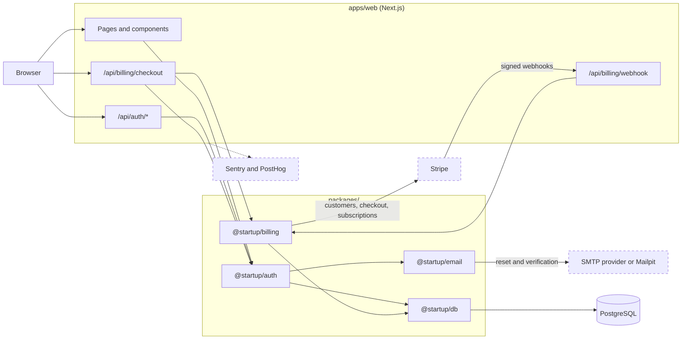

# Startup Template

## What this is

A production-oriented monorepo for starting a new web application.

It ships with the parts most products need on day one, already wired together and verified in CI:

- a Next.js application in a pnpm and Turborepo workspace
- PostgreSQL with Drizzle migrations
- authentication with Better Auth, with sign-up, sign-in, password reset, and account pages
- transactional email over SMTP for password reset and email verification, caught locally by Mailpit
- subscription billing with Stripe
- error monitoring with Sentry and product analytics with PostHog
- unit tests with Vitest and end-to-end tests with Playwright
- a repository harness that tells coding agents how to work here

Every integration except the database and authentication is optional locally. The application builds and runs without an email provider or Stripe, Sentry, or PostHog accounts.

The template lives at [github.com/allen-padilla/startup-template](https://github.com/allen-padilla/startup-template) and is set up as a GitHub template repository. New here? [Building a Product with an Agent](docs/guides/building-with-an-agent.md) walks an example product from cloning the template to shipping features, with a prompt for every step.

### Stack

| Area            | Technology                                    |
| --------------- | --------------------------------------------- |
| Application     | Next.js 16 (App Router), React 19, TypeScript |
| Styling         | Tailwind CSS 4                                |
| Workspace       | pnpm, Turborepo                               |
| Database        | PostgreSQL 17, Drizzle ORM                    |
| Authentication  | Better Auth                                   |
| Billing         | Stripe                                        |
| Email           | SMTP (Nodemailer), Mailpit locally            |
| Observability   | Sentry, PostHog                               |
| Testing         | Vitest, Playwright                            |
| CI              | GitHub Actions, Dependabot                    |

## Quick Start

### Requirements

- **Node.js 24.** `.node-version` pins it for version managers such as fnm and nvm.
- **pnpm through Corepack.** Corepack ships with Node.js 24 and installs the pnpm version pinned in `package.json`.
- **Docker**, or a compatible runtime that provides `docker compose`, for the local PostgreSQL database and Mailpit.
- **Git.**
- **OpenSSL**, to generate a local secret. Most systems already have it.

On Windows, work inside WSL and keep the repository on the Linux filesystem.

### Create and Run

Create your own repository from the template, either with **Use this template** on the [repository page](https://github.com/allen-padilla/startup-template) or with the GitHub CLI:

```bash
gh repo create my-app --template allen-padilla/startup-template --private --clone
```

Then set up and start the application:

```bash
cd my-app

corepack enable
pnpm install --frozen-lockfile

cp .env.example .env.local
sed -i.bak "s|^BETTER_AUTH_SECRET=.*|BETTER_AUTH_SECRET=$(openssl rand -base64 32)|" .env.local && rm .env.local.bak

pnpm db:up
pnpm db:migrate
pnpm dev
```

Open <http://localhost:3000>. Email sent by the application is captured by the local mail catcher, Mailpit, at <http://localhost:8025>.

The `sed` line writes a freshly generated secret into `.env.local` without printing it. Every other value copied from `.env.example` already works for local development.

To check your setup at any point, run `./scripts/check-environment.sh`. It verifies the Node.js version, pnpm, installed dependencies, the required environment variables, that `SMTP_URL` and `EMAIL_FROM` are set together, and Docker. It changes nothing and never prints a value.

### Environment

`.env.example` is committed. It documents every supported variable and contains only placeholders and safe local defaults. `.env.local` holds your local values. It is gitignored. Never commit it, and never put real credentials in `.env.example`. Three variables are required:

| Variable             | Visibility    | Purpose                                |
| -------------------- | ------------- | -------------------------------------- |
| `DATABASE_URL`       | server        | PostgreSQL connection string           |
| `BETTER_AUTH_SECRET` | server secret | signs sessions; at least 32 characters |
| `BETTER_AUTH_URL`    | server        | base URL of the application            |

They are validated when the application builds and starts. A missing or invalid value fails loudly instead of being ignored. Every other variable is optional, and its integration stays disabled while it is unset or empty. `SMTP_URL` and `EMAIL_FROM` are set together or not at all. See [`.env.example`](.env.example) and [docs/architecture/environment.md](docs/architecture/environment.md) for the rest.

Any variable that starts with `NEXT_PUBLIC_` is compiled into the browser bundle and is public. Never put a secret behind that prefix. Everything else stays on the server.

Generate a new `BETTER_AUTH_SECRET` for every environment with `openssl rand -base64 32`. Do not reuse one between projects, and do not use the CI placeholder outside CI.

## How It Fits Together



The browser only talks to the Next.js application. Route handlers stay thin: they check the session or the webhook signature, call a package, and turn errors into HTTP responses.

Each integration lives in one package. `@startup/auth` is the only code that imports `better-auth`, `@startup/billing` the only code that imports `stripe`, `@startup/email` the only code that sends email, and `@startup/db` the only code that opens a database connection.

Dashed services are optional locally. For how a payment becomes paid access, see [A Subscription, End to End](docs/architecture/billing.md#a-subscription-end-to-end).

### Pages and API Routes

| Route                        | What it does                                                                                 |
| ---------------------------- | -------------------------------------------------------------------------------------------- |
| `/`                          | placeholder landing page; "Get Started" goes to `/sign-up`                                   |
| `/sign-up`                   | name, email, and password; signs the user in and sends a verification email                  |
| `/sign-in`                   | email and password; one message for every failed sign-in                                     |
| `/forgot-password`           | requests a reset link; the same message for every address                                    |
| `/reset-password`            | sets a new password from the emailed link                                                    |
| `/account`                   | signed in only: the address, its verification state, resending verification, and sign-out   |
| `/api/auth/*`                | Better Auth: sign-up, sign-in, sign-out, sessions, password reset, and email verification    |
| `POST /api/billing/checkout` | signed in only: returns a Stripe Checkout URL for the Pro monthly price                      |
| `POST /api/billing/webhook`  | receives signed Stripe events and syncs subscription state                                   |

The pages are deliberately minimal. Products restyle or replace them and keep the behavior in [docs/specs/auth-pages.md](docs/specs/auth-pages.md). See [docs/architecture/authentication.md](docs/architecture/authentication.md#pages) and [docs/architecture/billing.md](docs/architecture/billing.md).

### Repository Layout

| Path                         | Contents                                                       |
| ---------------------------- | -------------------------------------------------------------- |
| `apps/web`                   | the Next.js application (`@startup/web`)                       |
| `packages/auth`              | Better Auth server and client (`@startup/auth`)                |
| `packages/billing`           | Stripe integration (`@startup/billing`)                        |
| `packages/db`                | Drizzle schema and migrations (`@startup/db`)                  |
| `packages/email`             | transactional email over SMTP (`@startup/email`)               |
| `packages/env`               | validated environment variables (`@startup/env`)               |
| `packages/ui`                | shared React components (`@startup/ui`)                        |
| `packages/typescript-config` | shared TypeScript configuration                                |
| `tests/e2e`                  | Playwright tests                                               |
| `docs`                       | architecture, guides, specs, plans, and the template checklist |
| `scripts`                    | repository automation                                          |

Applications depend on packages. Packages never depend on applications. See [docs/architecture/package-boundaries.md](docs/architecture/package-boundaries.md) for the dependency graph.

## Commands

Run commands from the repository root.

| Command            | What it does                                                                                     |
| ------------------ | ------------------------------------------------------------------------------------------------ |
| `pnpm dev`         | starts the Next.js development server on <http://localhost:3000>                                 |
| `pnpm db:up`       | starts PostgreSQL (`5432`) and Mailpit (`1025`, `8025`) on `127.0.0.1`, waits until ready        |
| `pnpm db:down`     | stops and removes the containers; the data volume is kept                                        |
| `pnpm db:migrate`  | applies the committed migrations in `packages/db/drizzle/`                                       |
| `pnpm db:generate` | generates a new migration from schema changes                                                    |
| `pnpm db:studio`   | opens Drizzle Studio                                                                             |
| `pnpm db:logs`     | follows the PostgreSQL logs                                                                      |
| `pnpm test`        | runs the Vitest unit and integration tests; needs no database and no running server              |
| `pnpm test:e2e`    | builds the application, starts it on port `3000`, runs the Playwright tests, and stops the server |
| `pnpm verify`      | agent harness check, lint, typecheck, tests, production build                                    |
| `pnpm verify:full` | `pnpm verify`, then the end-to-end tests                                                         |
| `pnpm agent:check` | checks the structure of the agent harness, such as skill frontmatter, referenced paths, and plan status |
| `pnpm agent:status` | shows where the work stands: plan and slice status, active branches and worktrees, and overlaps  |

Run `pnpm verify` before considering any change complete. Also run `pnpm verify:full` when a change affects application behavior or a complete user workflow, such as authentication, billing, or routing. Documentation-only changes do not need it.

`pnpm test:e2e` needs the local database and Mailpit running (`pnpm db:up`) with migrations applied, and ports `3000` and `9999` free, so stop `pnpm dev` first. Install the Playwright browser once per machine with `pnpm exec playwright install chromium`. On Linux, add `--with-deps` to also install the system libraries the browser needs. See [docs/architecture/testing.md](docs/architecture/testing.md).

PostgreSQL and Mailpit run in Docker Compose, configured in `compose.yaml`. They listen on `127.0.0.1` only, so other machines cannot reach them. Connect through `localhost` or `127.0.0.1`. To change the schema, follow the steps in [docs/architecture/database.md](docs/architecture/database.md): generate a migration, read its SQL for anything that loses data, apply it, and commit the schema change, the migration, and its metadata together.

## Building a Product with an Agent

[Building a Product with an Agent](docs/guides/building-with-an-agent.md) walks one made-up product, Feedbox, from an empty template to a shipped first version, with a coding agent doing the work and a prompt for every step:

1. **Create and set up the repository**, then replace the template's names.
2. **Build the base idea**: turn a short brief into a spec and a plan, then implement, verify, and review one slice at a time.
3. **Add features** at the size they need: one prompt, the full spec-and-plan loop, parallel worktrees, or debug mode.

The prompts work with any agent that reads `AGENTS.md`, such as Claude Code, Codex, or Cursor. You own the spec and the review. The agent owns the plan, the code, and the verification.

## Security

What the template does:

- **Sessions.** Better Auth keeps sessions in PostgreSQL, and server code reads them with `getSession()`, never from identity the browser asserts. Session cookie caching is off, so a revoked session stops working at once. Better Auth rejects browser requests from any origin other than `BETTER_AUTH_URL`. See [authentication](docs/architecture/authentication.md#sessions).
- **Password reset.** A reset link works once and expires after an hour, and using it ends every session for the account. A reset request gets the same response, after at least 500 ms, whether or not the address has an account. Reset and verification links redirect only to the application's own origin. See [authentication](docs/architecture/authentication.md#password-reset).
- **Names and email content.** The server accepts names of 1 to 100 characters on one line. Reset and verification emails contain nothing a user typed, not even the name, because anyone can sign up with someone else's address. See [email](docs/architecture/email.md#content).
- **Rate limits.** In production, including the E2E server, which runs in production mode: 10 sign-ups per hour per client IP; 3 requests per 60 seconds per IP and 3 per hour per address for each endpoint that sends email; and Better Auth's defaults elsewhere, such as 3 sign-ins per 10 seconds per IP. The counters are in PostgreSQL, so they hold across serverless instances. See [authentication](docs/architecture/authentication.md#rate-limits).
- **Security headers.** Every route sends `X-Content-Type-Options: nosniff`, blocks framing (`X-Frame-Options: DENY` and `frame-ancestors 'none'`), and sends `Referrer-Policy: strict-origin-when-cross-origin` (`no-referrer` on `/reset-password`), `Strict-Transport-Security`, and a `Permissions-Policy` that turns off the camera, microphone, and location. Products change them in `apps/web/next.config.ts`. See [deployment](docs/architecture/deployment.md#security-headers).
- **Tokens stay out of Sentry and PostHog.** The reset page removes its token from the URL before either starts, and every Sentry error and span and every PostHog event passes through `scrubAuthTokens`. Sentry collects no user info, request bodies, or identifying headers and cookies. Failed emails are reported without the link, token, recipient, or body. See [observability](docs/architecture/observability.md).
- **Stripe webhooks.** The handler verifies the signature over the raw body before trusting the payload, then re-reads the subscription from Stripe. Paid access comes only from that synchronized state, through `getUserEntitlement`, never from a checkout redirect. See [billing](docs/architecture/billing.md#webhooks).
- **Secrets.** `@startup/env` validates server variables, and only `NEXT_PUBLIC_*` values reach the browser. Local PostgreSQL and Mailpit listen on `127.0.0.1` only. See [environment](docs/architecture/environment.md).

What each product decides for itself:

- **Authorization for its own data.** Every route and query that returns a user's records must check that the signed-in user may see them.
- **What unverified users may do.** Verification is recorded, not enforced. Decide with `session.user.emailVerified`.
- **Bot protection.** Per-client limits do not stop sign-ups spread across many IP addresses. Better Auth has a `captcha` plugin. Behind your own proxy, configure how the client IP is read. See [deployment](docs/architecture/deployment.md#rate-limits).
- **A `script-src` Content-Security-Policy.** The template's policy restricts only framing.
- **Other sign-in methods.** Only email and password ship: no two-factor authentication, passkeys, or social sign-in.
- **Privacy and account obligations.** A privacy policy and terms, consent before analytics, account deletion, and online cancellation. See [Configure Before Production](docs/template-checklist.md#configure-before-production).
- **Operations.** Backups, uptime monitoring, and secret rotation. See [deployment](docs/architecture/deployment.md).

## Documentation

| Document                                                                           | What it answers                                                                                     |
| ---------------------------------------------------------------------------------- | --------------------------------------------------------------------------------------------------- |
| [AGENTS.md](AGENTS.md)                                                             | What must every coding agent follow here, and where are the detailed rules and skills?              |
| [Building a Product with an Agent](docs/guides/building-with-an-agent.md)          | How do I go from this template to a shipped product with a coding agent?                            |
| [Template checklist](docs/template-checklist.md)                                   | What do I replace and configure after creating a project from the template?                         |
| [Agent workflows](docs/architecture/agent-workflows.md)                            | How do the harness layers fit together, which guidance wins, how is task state recorded, and what does `pnpm agent:check` check? |
| [Parallel development](docs/architecture/parallel-development.md)                  | How do several tasks run at once, each in its own branch and Git worktree?                          |
| [Package boundaries](docs/architecture/package-boundaries.md)                      | What does each package do, and which may depend on which?                                           |
| [Environment](docs/architecture/environment.md)                                    | Which variables exist, which are secret or public, and how are they validated?                      |
| [Database](docs/architecture/database.md)                                          | How does the local database run, and how do I change the schema safely?                             |
| [Authentication](docs/architecture/authentication.md)                              | How do sessions, the pages, email links, and rate limits work?                                      |
| [Email](docs/architecture/email.md)                                                | How do I configure SMTP and add a message?                                                          |
| [Billing](docs/architecture/billing.md)                                            | How do checkout and webhooks work, and what decides paid access?                                    |
| [Observability](docs/architecture/observability.md)                                | How are Sentry and PostHog set up, and what must they never receive?                                |
| [Testing](docs/architecture/testing.md)                                            | What do `pnpm verify` and the end-to-end tests cover, and what do E2E runs need?                    |
| [Continuous integration](docs/architecture/continuous-integration.md)              | What runs on every pull request, and why do the checks not block merging on a private Free-plan repository? |
| [Deployment](docs/architecture/deployment.md)                                      | How do I deploy: hosting, production variables, migrations, webhooks, and secrets?                  |
| [Dependencies](docs/architecture/dependencies.md)                                  | How do I add or upgrade a dependency, and which upgrades are held back?                             |
| [Specs](docs/specs/README.md)                                                      | How do I write a feature spec?                                                                      |
| [Plans](docs/plans/README.md)                                                      | How do I write an implementation plan and keep its status current?                                  |

## Using This as a Template

After creating a project from this template, replace these values first:

- `.github/CODEOWNERS`: the owner is `@allen-padilla`, the template maintainer
- `package.json`: `name`, `description`, `license`, and `author`
- `LICENSE`: keep the template's notice and add your own license; see [License](#license)
- this README: the title, the introduction, the clone command, and the closing maintainer line
- `EMAIL_FROM` and `productName` in `packages/email/src/templates/brand.ts`: the email sender and the product name in email copy
- `apps/web/src/app/layout.tsx` and `page.tsx`: the application title, description, and landing page
- `apps/web/src/app/favicon.ico`: the icon
- Stripe, your SMTP provider, Sentry, and PostHog: your own accounts, products, and projects

The `@startup/*` package names and the local database credentials are intentional template defaults and are safe to keep.

See [docs/template-checklist.md](docs/template-checklist.md) for the full list, including what must change before production.

## License

The template is released under the [MIT License](LICENSE).

You may use it for any project, open source or proprietary. Keep the template's copyright and permission notice in your project, and choose your own license for the code you add.

---

Maintained by Allen.
