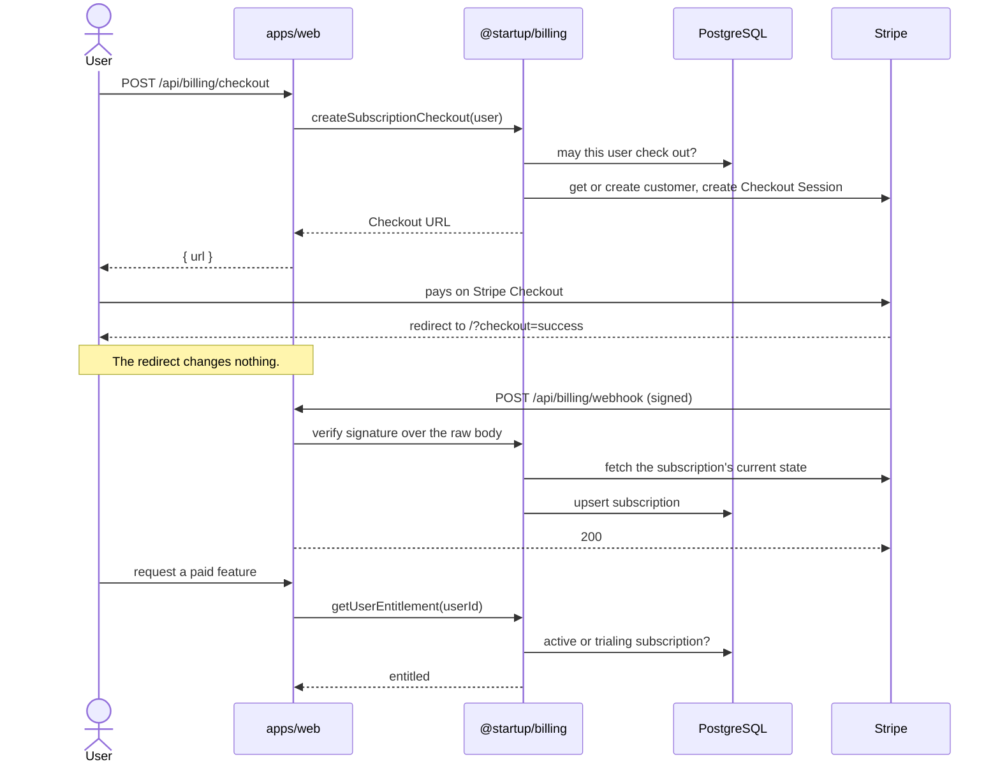

# Billing

Stripe is the external billing provider.

## Boundaries

`@startup/billing` owns the server-side Stripe integration: the Stripe SDK, customer mapping, checkout, webhook verification, and subscription synchronization.

It is server-only. It depends on `@startup/db` and `@startup/env`.

- Applications must not import `stripe` directly.
- Client components must not import `@startup/billing`.
- Route handlers stay thin: they authenticate, call `@startup/billing`, and map errors to HTTP responses.

## Configuration

| Variable                   | Purpose                                     |
| -------------------------- | ------------------------------------------- |
| `STRIPE_SECRET_KEY`        | Stripe API key (`sk_…` or restricted `rk_…`) |
| `STRIPE_WEBHOOK_SECRET`    | Webhook signing secret (`whsec_…`)          |
| `STRIPE_PRICE_PRO_MONTHLY` | Stripe Price ID for the Pro monthly plan    |

All three are server-only and validated by `@startup/env`. They must never use the `NEXT_PUBLIC_` prefix.

Price IDs are configuration. Checkout always uses the server-configured price. Client-supplied price IDs are never authoritative.

Billing is optional locally. Unset or empty values do not break builds. Invoking a billing endpoint without the configuration it needs raises `BillingConfigurationError`, which the routes return as `503`.

Checkout success and cancel URLs are built from `BETTER_AUTH_URL`, the application's validated base URL.

The Stripe API version is the version pinned by the installed `stripe` SDK.

## Data Model

Tables are defined in `packages/db/src/schema/billing.ts`.

`billing_customers` maps an application user to a Stripe customer:

- one row per user (`user_id` is the primary key)
- `stripe_customer_id` is unique

The application user ID is the identity key. It is also stored in the Stripe customer's `metadata.userId`. Email is not used as an identity key.

`subscriptions` holds local subscription state:

- `stripe_subscription_id` is unique
- `status` is the Stripe subscription status, stored as text
- `current_period_end` comes from the subscription item (Stripe API `2025-03-31.basil` and later)
- `cancel_at_period_end` and `cancel_at` (nullable) record a scheduled cancellation

Subscriptions are assumed to have exactly one item (one price). Synchronization reads the first item's price and period and ignores any others. See Known Limitations.

Both tables cascade on user deletion. This removes local state only; it does not cancel anything in Stripe.

## A Subscription, End to End



Paying does not grant access by itself. Access changes only when a verified webhook arrives, and the handler re-reads the subscription from Stripe instead of trusting the event, so duplicate or out-of-order deliveries end in the same state.

Code that needs to know whether a user has paid calls `getUserEntitlement`. See Entitlements.

## Checkout

`POST /api/billing/checkout`

1. Requires a Better Auth session (`401` otherwise).
2. Rejects users whose existing subscription blocks checkout with `409` and `{ "error": "already_subscribed" }`. See Checkout Eligibility.
3. Gets or creates the user's Stripe customer. Creation uses an idempotency key derived from the user ID.
4. Creates a subscription-mode Checkout Session for the configured price.
5. Returns `{ url }` for the caller to redirect to.

Redirects are not proof of payment. The success redirect does not change any local state.

## Webhooks

`POST /api/billing/webhook`

The handler reads the raw body with `request.text()` and verifies the `stripe-signature` header against `STRIPE_WEBHOOK_SECRET` before trusting anything in the payload. Missing or invalid signatures return `400`.

Handled events:

- `checkout.session.completed`
- `customer.subscription.created`
- `customer.subscription.updated`
- `customer.subscription.deleted`

Other events are acknowledged and ignored.

Handled events only identify which subscription changed. The handler fetches the subscription's current state from Stripe and upserts it on `stripe_subscription_id`. As a result:

- duplicate deliveries produce the same row
- out-of-order deliveries converge on Stripe's current state
- `checkout.session.completed` records the subscription's actual Stripe status, not the checkout outcome
- cancellations and deletions update `status` and keep the row

A subscription whose Stripe customer has no local mapping is acknowledged (`200`) and not stored. This happens when a customer is created in the Stripe Dashboard or by another environment that shares the Stripe account. Retrying cannot fix it, so nothing is retried. The route logs the event ID, event type, and Stripe customer ID.

Real processing failures return `500` so Stripe retries the delivery. These include Stripe API errors, database errors, and subscriptions that cannot be interpreted.

## Entitlements

Verified, synchronized subscription state in `subscriptions` is the source of truth for paid access. Nothing else grants it: not checkout completion, not a success redirect, not client state.

`@startup/billing` owns the entitlement policy. Applications must use it rather than querying `subscriptions` or interpreting Stripe statuses themselves:

- `getUserEntitlement(userId)` returns `{ entitled: false }` or `{ entitled: true, subscription }` with the entitling subscription's details.
- `isEntitledStatus(status)` and `ENTITLED_SUBSCRIPTION_STATUSES` expose the policy itself.

Entitled statuses: `active`, `trialing`.

Not entitled: `past_due`, `unpaid`, `paused`, `incomplete`, `incomplete_expired`, `canceled`, and any status Stripe introduces later.

A subscription with a scheduled cancellation (`cancel_at_period_end` or `cancel_at`) stays entitled until Stripe changes its status.

## Checkout Eligibility

Checkout eligibility is a separate policy from entitlement, also owned by `@startup/billing`:

- **Entitlement** answers "does this user have paid access right now?"
- **Checkout eligibility** answers "may this user start a new subscription?"

Checkout eligibility is deliberately **fail-closed** to prevent duplicate subscriptions. It lists the statuses that *allow* a new checkout, and every other status blocks it:

- Allowed: no subscription at all, or only subscriptions in `canceled` or `incomplete_expired` (`CHECKOUT_ALLOWING_SUBSCRIPTION_STATUSES`). Both are terminal: Stripe will never make those subscriptions active again.
- Blocked: any other status, including `active`, `trialing`, `past_due`, `incomplete`, `unpaid`, `paused`, and any status Stripe introduces later.

`blocksNewCheckout(status)` and `getCheckoutEligibility(userId)` apply the policy. Applications must not interpret statuses for checkout themselves.

Blocking checkout does **not** grant entitlement. `past_due`, `incomplete`, `unpaid`, and `paused` block checkout but are not entitled. In each case a subscription still exists in Stripe and may recover or be resumed. The fix is to resolve that subscription, not to create a second one. An unknown status is treated the same way: it cannot grant access, and it cannot open a path to a duplicate subscription until the policy is updated deliberately.

## Local Development

Use Stripe test mode (`sk_test_…`). Never use live keys in development or tests.

Forward webhooks to the local app with the Stripe CLI:

```sh
stripe listen --forward-to localhost:3000/api/billing/webhook
```

The command prints the `whsec_…` value to use as `STRIPE_WEBHOOK_SECRET`.

## Testing

`@startup/billing` tests run with Vitest and do not contact Stripe:

- Stripe calls go through injected clients, with fakes in tests.
- Webhook payloads are signed locally with `Stripe.webhooks.generateTestHeaderString`.
- Database behavior runs against in-memory PGlite with the repository migrations applied.

`tests/e2e/billing.spec.ts` covers unauthenticated checkout and webhook signature rejection. It does not drive Stripe-hosted Checkout.

## Known Limitations

These are intentional for now:

- **Single-item subscriptions.** Multi-item subscriptions are not modeled.
- **Timestamps without time zone.** Billing tables follow the repository convention (`timestamp` without time zone).
- **Duplicate `drizzle-orm` resolution.** PGlite (a billing test dependency) is an optional peer of `drizzle-orm`. As a result, `@startup/db` and `@startup/billing` resolve one copy of `drizzle-orm`, while Better Auth's Drizzle adapter resolves a sibling copy of the same version.
- **No payment recovery flow.** Users with a `past_due`, `incomplete`, `unpaid`, or `paused` subscription are blocked from a new checkout, but there is no in-app way (such as a customer portal) to fix the payment or resume the subscription yet.
- Customer portal, plan changes, coupons, taxes, usage billing, seats, and credits are out of scope. Trials exist only as Stripe's `trialing` status.
