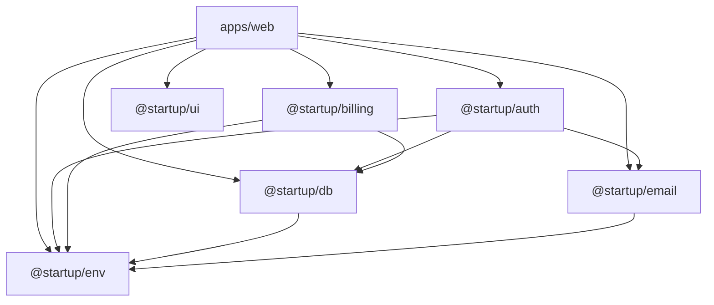

# Package Boundaries

## Applications

`apps/` contains deployable applications.

Applications may depend on packages.

Packages must not depend on applications.

## Packages

`packages/` contains reusable capabilities and shared infrastructure.

Packages should expose intentional public APIs rather than requiring consumers to import arbitrary internal files.

## Dependency Direction

Allowed:

packages → external dependencies

apps → packages → external dependencies

Not allowed:

packages → apps

## Dependency Graph

Arrows point from a package to what it depends on. Every package also uses `@startup/typescript-config`, which is left out to keep the graph readable.

## Current Packages

### @startup/typescript-config

Shared TypeScript configuration for the repository.

This package contains configuration only and must not contain application runtime code.

### @startup/ui

Shared React UI components and design-system primitives.

Applications may depend on this package.

The package must not depend on application code.

Consumers should import from the package's public API rather than internal source paths.

Shared UI primitives belong here when they are reusable across application surfaces.

### @startup/env

Validated environment configuration.

- `@startup/env` exports server-only configuration (`serverEnv`).
- `@startup/env/client` exports browser-safe `NEXT_PUBLIC_*` configuration (`clientEnv`) and must not import server configuration.

See `environment.md`.

### @startup/db

PostgreSQL access through Drizzle ORM: the shared connection (`db`) and schema, plus `migrateDatabase` (`./migrate`), which the server calls at start when `RUN_MIGRATIONS` is `true`.

Server-only. Depends on `@startup/env`.

See `database.md`.

### @startup/auth

Better Auth configuration.

- `@startup/auth` exports the server auth instance and is server-only.
- `@startup/auth/client` exports the browser-safe auth client.
- `@startup/auth/next` exports the server-only Next.js route handler (`authHandler`) and `getSession()`.
- `@startup/auth/redact` exports `scrubAuthTokens`, which removes authentication tokens from data before it is sent to observability systems. It is browser-safe and has no imports.
- `@startup/auth/redirect` exports `safeRedirectPath`, the rule for redirects after sign-in and sign-up. It is browser-safe and has no imports.

Depends on `@startup/db`, `@startup/email`, and `@startup/env`. Takes `next` as a peer dependency for `after()`.

See `authentication.md`.

### @startup/billing

Server-side Stripe integration: customer mapping, checkout, webhook verification, and subscription synchronization.

Server-only. Owns the `stripe` dependency. Depends on `@startup/db` and `@startup/env`.

See `billing.md`.

### @startup/email

Transactional email over SMTP: `sendEmail`, `createEmailSender`, typed message templates, and `Email*` errors.

- `@startup/email` is server-only.
- `@startup/email/brand` exports `productName`, the one place the product name is set. It has no imports and is browser-safe.

Owns the `nodemailer` dependency. Depends on `@startup/env`. The only code that opens an SMTP connection.

See `email.md`.
